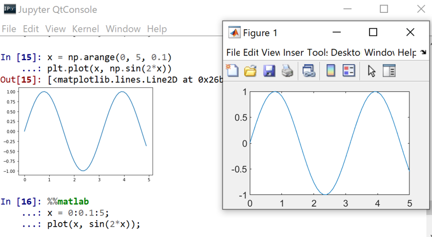

# matcall



"MATLAB engine API for Python" is a little bit troublesome to handle. This Python module makes it easy to run MATLAB functions and use MATLAB classes in Python codes. You can do almost anything in Python as in MATLAB.

## Contents

Following included:

- `MatCaller`, which handles MATLAB.
- `MatFunction`, which dynamically defines a function in Python from MATLAB function (including constructor).
- `MatClass`, which dynamically defines a class in Python from MATLAB class.
- `MatStruct`, which makes MATLAB's `struct` like object.
- `%%matlab` magic command.

## Preparation

First launch MATLAB in Python and make an instance by `mat = MatCaller()`. **Make sure you have downloaded MATLAB engine API for Python correctly**.

```python
from matcall import MatCaller
import numpy as np

mat = MatCaller()
```

To add a path "C:/Users/..." to MATLAB engine, use addpath(path) function. You can also recursively add directory paths that .m files are contained.

```python
mat.addpath(r"C:\Users\...")
mat.addpath(r"C:\Users\...", child=True)
```
## MATLAB to Python conversion table

|MATLAB|Python|
|:----:|:----:|
|`logical`|`bool`|
|matrix (1x1)|`int` or `float`|
|matrix (1xN)|1-dim `ndarray`|
|matrix (Mx1)|1-dim `ndarray`|
|matrix (MxN)|`ndarray`|
|`char`|`str`|
|`cell`|`list`|
|`struct`|`MatStruct`|
|`function_handle`|`MatFunction`|
|others|`MatClass`|

## MATLAB to Python conversion table

|Python|MATLAB|
|:----:|:----:|
|`bool`|`logical`|
|`int` or `float`|matrix (1x1)|
|`str`|`char`|
|`list` or `tuple`|`cell`|
|`dict` or `MatStruct`|`struct`|
|`ndarray`|matrix|
|`MatFunction`|`function_handle`|
|`MatClass`|corresponding object|

# Basic Usage

## Use MATLAB Console

You can run MATLAB using `console` and obtain one object as return value.

```python
out = mat.console()
```
```
    --- Input ---
(MATLAB) In >>> a = 1:5;
(MATLAB) In >>> b = sqrt(a);
(MATLAB) In >>> return b
```
```python
out
```
```
[Out]
    array([1.        , 1.41421356, 1.73205081, 2.        , 2.23606798])
```
IPython magic is also supported.

```python
%%matlab
data.time = 1:100;
data.signal = sin(data.time/5.2);
data.name = "wave";
data
```
```
[Out]

    data = 

    struct with fields:

        time: [1x100 double]
        signal: [1x100 double]
        name: "wave"
```


## Use MATLAB Functions

MATLAB functions can be translated to Python function by

```python
mMax = mat.translate("max")
mMax
```
```
[Out]
    MatFunction<max>
```
```python
mMax(np.array([3,6,4]))
```
```
[Out]
    [6, 2.0]
```
MATLAB lambda function is also supported.
```python
sq = mat.translate("@(t)t^2")
sq 
```
```
[Out]
    MatFunction<@(t)t^2>
```
```python
sq(10)
```
```
[Out]
    100
```

## Use MATLAB Classes, Properties and Methods

Translation of MATLAB class constructor is also possible. Here constructor (not the class itself!) is returned and Python class will be dynamically defined with it. Same object
is sent to MATLAB workspace only when it's needed.

```python
mycls = mat.translation("MyClass")
obj = mycls(x1, ..., xn)
obj
```
```
[Out]
    MatClass<MyClass>
```

Setter and getter are also (mostly) defined so that you can deal with the properties in a very simple way.

```python
mplot = mat.translate("plot")
pl = mplot(x, y)    # A figure window is openned here.
pl.Color = "red"    # The line color is changed to red here.
```

A struct object in MATLAB is translated to dict object in Python by default. However, it is a little bit troublesome to access the contents of dict, compared to MATLAB struct (at least you need to type double quotation every time). Thus, here in matcall a `MatStruct` object is returned instead.

Following example shows how to solve ODE using MATLAB `ode45` function.

```python
xlim = np.array([0., 20.])
v0 = np.array([2.,0.]).T
vdp1 = mat.translate("vdp1")
ode45 = mat.translate("ode45")
result = ode45(vdp1, xlim, v0)
result
```
```
[Out]
    MatStruct with 6 fields:
        solver: ode45
        extdata: MatStruct object (3 fields)
            x: np.ndarray (60,)
            y: np.ndarray (2, 60)
        stats: MatStruct object (3 fields)
        idata: MatStruct object (2 fields)
```


## Operators and Built-in Functions

Special methods are converted correctly so that almost all the calculations overloaded in MATLAB are supported in Python. The table below shows the examples of overloads.

|MATLAB|Python|What is supported|
|:----:|:----:|:---------------:|
|`plus`|`__add__`, `__radd__`| `x + y`|
|`eq`|`__eq__`|`x == y`|
|`char`|`__str__`|`str(x), print(x)`|

Following code is an example of calculating derivative using symbolic variables.

```python
sym = mat.translate("sym")
diff = mat.translate("diff")
x = sym("x")
A = sym("A")
f = A * np.sin(x)**2
print(diff(f))
```
```
[Out]
    2*A*cos(x)*sin(x)
```