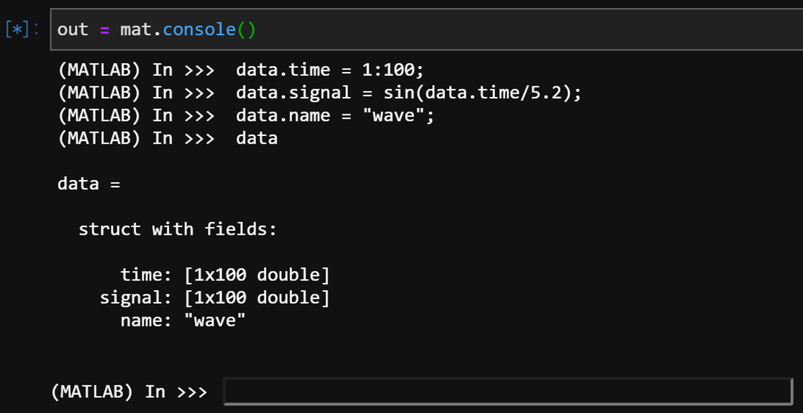
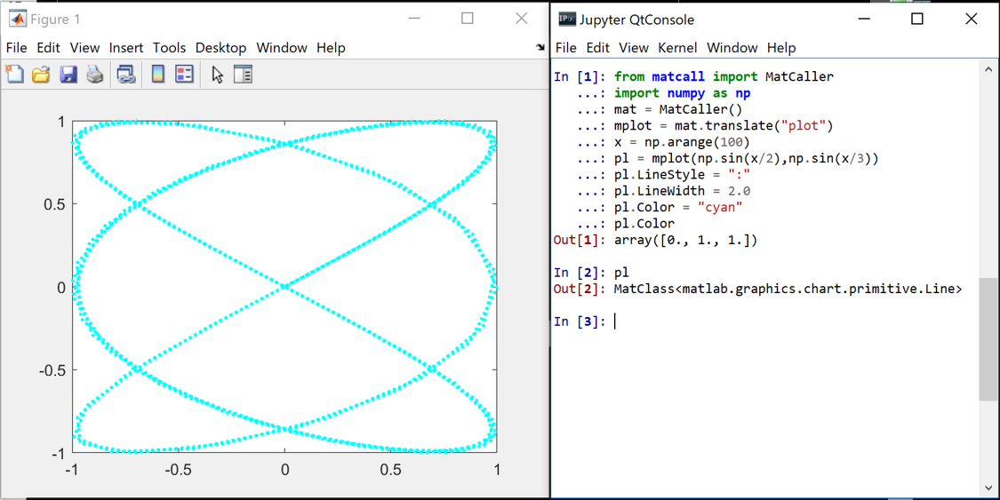
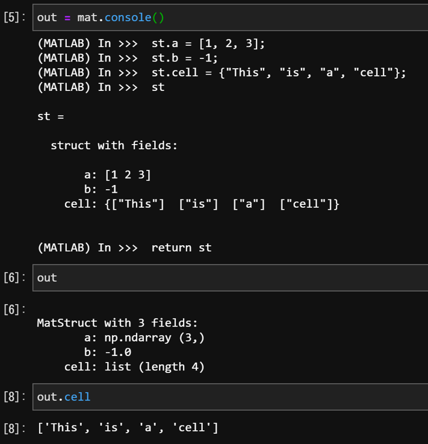

# matcall
A Python file that makes it easy to run MATLAB functions and use MATLAB classes in Python codes.
Following classes are contained:
- `MatCaller`, which handles MATLAB.
- `MatFunction`, which dynamically defines a function in Python from MATLAB function (including constructor).
- `MatClass`, which dynamically defines a class in Python from MATLAB class.
- `MatStruct`, which makes MATLAB's `struct` like object.



## Preparation

First launch MATLAB in Python and make an instance. **Make sure you have downloaded MATLAB engine API for Python correctly**.

```python
from matcall import MatCaller
import numpy as np

mat = MatCaller()
```

To add a path "C:/Users/..." to MATLAB engine, use addpath(path) function. You can also recursively add directory paths that .m files are contained.

```python
mat.addpath(r"C:\Users\...")
mat.addpath(r"C:\Users\...", child=True)
```
## MATLAB to Python conversion table

|MATLAB|Python|
|:----:|:----:|
|`logical`|`bool`|
|matrix (1x1)|`int` or `float`|
|matrix (1xN)|1-dim `ndarray`|
|matrix (Mx1)|1-dim `ndarray`|
|matrix (MxN)|`ndarray`|
|`char`|`str`|
|`cell`|`list`|
|`struct`|`MatStruct` object|
|others|`MatClass` object|

## MATLAB to Python conversion table

|Python|MATLAB|
|:----:|:----:|
|`bool`|`logical`|
|`int` or `float`|matrix (1x1)|
|`str`|`char`|
|`list` or `tuple`|`cell`|
|`dict` or `MatStruct`|`struct`|
|`ndarray`|`matrix`|

## Basic Usage

You can run MATLAB using `console` and obtain one object as return value.

```python
out = mat.console()

#  --- Input ---
# (MATLAB) In >>> a = 1:5;
# (MATLAB) In >>> b = sqrt(a);
# (MATLAB) In >>> return b
```
```python
out

#  --- Output ---
# array([1.        , 1.41421356, 1.73205081, 2.        , 2.23606798])
```

MATLAB function can be translated to Python function by

```python
mMax = mat.translate("max")
mMax

#  --- Output ---
# MatFunction<max>
```
```python
mMax(np.array([3,6,4]))

#  --- Output ---
# [6, 2.0]
```
Translation of MATLAB class constructor is also possible. Here constructor (not the class itself!) is returned and Python class will be dynamically defined with it. Same object
is sent to MATLAB workspace only when it's needed.

```python
mycls = mat.translation("MyClass")
obj = mycls(x1, ..., xn)
obj

#  --- Output ---
# MatClass<MyClass>
```

Setting/getting method is also (mostly) defined so that you can deal with the properties in a very simple way.

```python
mplot = mat.translate("plot")
pl = mplot(x, y)    # A figure window is openned here.
pl.Color = "red"    # The line color is changed to red here.
```

This is an example of how to manipulate the MATLAB figure from Python.



A struct object in MATLAB is translated to dict object in Python by default. However, it is a little bit troublesome to access the contents of dict, compared to MATLAB struct (at least you need to type double quotation every time). Thus, here in matcall a `MatStruct` object is returned instead.


